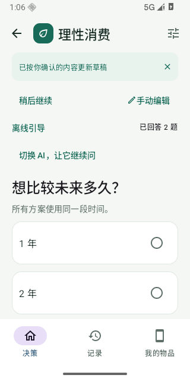

# 理性消费 V0.2

Android 消费决策工具。理论 V4.2.1，软件规格 V1.0.0。本地六模型计算、可自行配置的 AI 引导与手动填写。

[下载 Android APK](https://github.com/lihanhong2002/consumer-decision-android/releases/latest) · [验收记录](docs/VALIDATION_V0_2.md) · [MIT 许可证](LICENSE)

Android 8.0（API 26）及以上可安装。Release 提供调试 APK、完整源码 ZIP 和 SHA-256 校验文件。APK 使用调试签名；自行构建或 CI 的签名可能不同，不能保证覆盖安装，换包前请先导出 JSON 备份。

| 首页 | 一次一题引导 |
|---|---|
|  |  |

## 工程

- `core`：纯 Kotlin 六模型、需求、路径投影、必须条件、Pareto、线性偏好、严格 JSON、确定性快照和受限 AI 字段建议协议。
- `data`：Room 草稿、问答、修改记录、物品、复用参数、不可变计算及来源、真实选择、全量备份和原子导入。
- `app`：中文 Compose 问答、手动编辑、输入确认、比较卡片、完整追踪、个人 AI 配置与 Android 文件选择器。

环境使用 JDK 17、AGP 9.1.1、Gradle 9.3.1、Room 2.8.5。SDK 36，最低 Android 8/API 26。项目位于中文目录时已启用 AGP 路径检查兼容配置。

## 本地构建

首次环境已安装至 `.tools`（不纳入源码）。其他机器需要 JDK 17、Android SDK 36，并在 `local.properties` 设置 `sdk.dir`。

```bash
git clone https://github.com/lihanhong2002/consumer-decision-android.git
cd consumer-decision-android
# 安装 platforms;android-36、build-tools;36.0.0、platform-tools
# 在 local.properties 设置 sdk.dir，或设置 ANDROID_HOME
./gradlew :core:test :app:testDebugUnitTest :app:lintDebug :app:assembleDebug
```

Windows 可使用 `gradlew.bat`，或下面的 PowerShell 脚本。Linux/macOS 使用 `./gradlew`。工程不需要项目作者的本机缓存或工具链。

```powershell
./build.ps1
./build.ps1 -Connected
```

APK 构建输出：`app/build/outputs/apk/debug/app-debug.apk`。

Windows 工程路径包含中文时，脚本在工程所在盘的根目录建立 `sixmodel-build` 联接，避免 JVM 子进程路径兼容问题；不要求存在 D 盘。联接已指向其他工程时会停止，不覆盖已有目录。建议把源码检出到有写入权限的英文路径。Wrapper 发行包的 SHA-256 已锁定。

## 使用

首页选择“开始一次决策”进入一次一题的引导，也可“我想自己填写”。右上角配置个人 DeepSeek 或兼容接口：HTTPS 服务地址、模型名称、API 密钥，勾选启用与数据发送说明，再保存并测试连接。默认地址 https://api.deepseek.com，模型名 deepseek-flash，可修改；需要服务商的 API 密钥，应用不提供共享密钥或代付额度。

AI 参考随应用打包的完整模型规格和工程约定，提出问题和字段建议。每项建议显示依据、来源及确定程度；用户确认后更新共同草稿。网络错误、非法字段或过期回答不会覆盖手动修改。未知信息保留缺口，不替换成零。未配置 AI 时可使用离线基础引导、完整手动编辑和本地计算。

问答与手动编辑可随时切换，已提交答案和未提交的文字会自动保存。近期修改可撤销。当前物品与使用习惯可以保存到“我的物品”；预算与通用参数可在参数检查页记住，下次自行选择复用，并重新确认。

正式计算前查看输入摘要，核实当前状态、估计、预设、需求系数和费用，确认后计算。至少两个方案，使用阶段须连续覆盖比较时间；升级需明确主对照。手机示例仍是演示记录，不代表真实商品或消费建议。

普通费用界面填写正金额，应用区分支出与收入；高级输入仍使用支出负、收入正。维修费用用事件 ID 关联，避免重复记账。时点零预算不抵扣收入，全期支出上限可另设。区间参数保留原边界，正式计算前明确选择本次值。

正式计算创建不可变历史快照；编辑和重算不覆盖旧结果。选择与 AI 解读绑定实际计算记录。结果提供各方案取舍、使用过程、六模型和追踪；可建立衰减速度快/慢 20% 的独立情景草稿，确认假设后计算。

Room 版本 1→2 提供显式迁移。JSON 备份版本 2.0.0 包含历史、问答、来源、物品、复用参数和 AI 解读；支持导入旧版 1.0.0。未知重要字段、不支持版本、破损引用和相同 ID 内容冲突会拒绝整次导入，不部分写入。

AI 密钥和配置使用 Android Keystore AES-GCM 加密，仅保存在设备中，不进入 JSON 备份。使用 AI 时仅发送当前决策和最近回答；结果解读会发送该次输入及计算摘要。手动填写和核心计算不需要网络。

## 理论与工程边界

- 不默认输出加权总分。只有用户确认四项权重及固定尺度后才排序 Pareto 前沿。
- `rho` 使用 VALUE、NOT_APPLICABLE、NO_POSITIVE_RELEVANT_UPGRADE、INVALID_INPUT 状态。
- 有效寿命未观察到失效时为右删失，不是无穷寿命。Pareto 仅在能证明寿命次序时作支配判断；两项右删失结果不能据下界证明次序。
- `path-projection-1`：M1～M5保存各阶段结果，用户指定主资产/主升级对照形成共同 Z；M6覆盖全路径。阶段结果不求和成路径效用。服务约束检查所有阶段。
- 初始归一化效用和维修后的分段衰减是显式工程扩展，记录于 trace。同身份相邻阶段必须保持效用连续。
- 同一决策共用 H、步长、币种及现金流基线。非整步长使用 N=ceil(H/dt)，事件映射到其后的第一个现金流格，期末残值按第 N 格贴现。
- 缺失或未确认的必要参数拒绝正式计算。需求模块不依赖商品数据，现金流模型不读取功能或情感价值。

## 验证

V0.1 验收见 `docs/VALIDATION.md`；V0.2 验收见 `docs/VALIDATION_V0_2.md`。未来新公式、映射或版本必须增加对应实现及迁移，不得静默重算旧快照。

GitHub Actions 自动运行核心测试、接口协议测试、Lint 和 APK 构建，并保留构建报告。API 26/36 的设备验收属于上述记录，不由 CI 的 JVM 测试代替。

DeepSeek 接口依据：https://api-docs.deepseek.com/guides/json_mode/ 。本次没有用户 API 密钥，真实付费服务连通性需在应用“保存并测试连接”中验证。

## 开源与隐私

项目自有代码与模型规范文档采用 MIT，版权署名 `2026 lihanhong2002`。第三方组件保持其原始许可，见 [第三方声明](THIRD_PARTY_NOTICES.md)。示例、测试输入和截图均为演示数据。

仓库不含个人数据库、JSON 用户备份、真实 API 密钥、签名私钥、Android SDK、JDK 或模拟器原始日志。发现问题可通过 [Issues](https://github.com/lihanhong2002/consumer-decision-android/issues) 反馈；提交日志前请去掉密钥、个人输入和备份内容。
